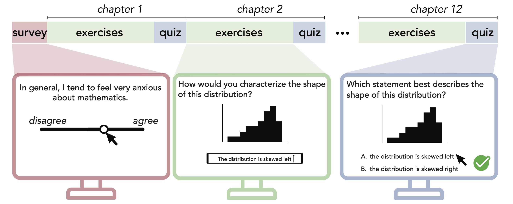

# Linking student psychological orientation, engagement, and learning in college-level introductory data science

This repository contains code to reproduce the results in our CogSci 2025 paper, [Linking student psychological orientation, engagement, and learning in college-level introductory data science]()

<p align="center">
  </img>
</p>

## Layout

```
├── analysis
│   ├── observational
│   └── experimental    
├── data
│   ├── 2023-college
│   └── 2024_fall_clean   
├── experiments
│   ├── control_module
│   ├── intervention_module
│   └── survey_items
├── paper
├── results
│   ├── 2023-college
│   └── 2024_fall
```

`analysis`: contains R scripts for data processing and analysis. 
* `observational`: includes all scripts to clean and analyze data in study 1. Run `run_R_2023_scripts.sh` to derive all figures and results.
*  `experimental`: includes all scripts to clean and analyze data in study 2. Run `run_R_2024_scripts.sh` to derive all figures and results.


`data`: includes data for both studies. See [data/readme.md](./data/README.md) for details. 

`experiments`: includes control and intervention materials for study 2.

`results`: includes unedited figures in paper and modeling results.

`paper`: contains the LaTeX source code along with figures.


## Study 1 (observational)
We analyzed data from 1306 students across 11 institutions to investigate how students’ initial psychological orientation relates to their subsequent engagement and learning.

## Study 2 (experimental)

We developed and tested an intervention aspects of students’ learning experience (e.g. mindsets about stress and metacognitive awareness) among 146 students enrolled in a single course.

